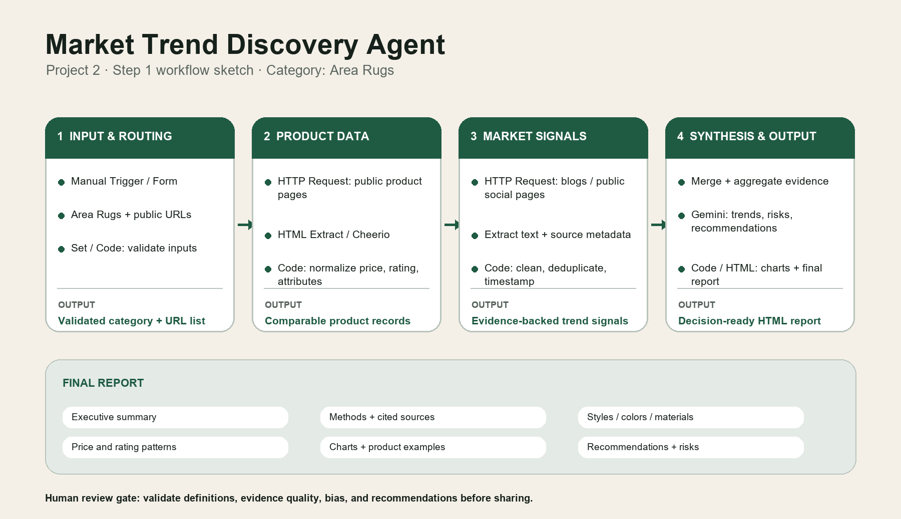

# Project 2 — Step 1: Workflow Sketch

## Category choice

I chose Area Rugs because they represent the broadest and most commercially relevant category, with enough variation in materials, colors, patterns, price points, and customer use cases to reveal meaningful market trends. This category also builds naturally on my moodboard work from Project 1, allowing me to connect visual inspiration with data-driven merchandising insights.

## Proposed workflow

1. **Input & Routing** — receive the Area Rugs category and a list of public source URLs; validate the inputs.
2. **Product Data Collection** — fetch public product pages, extract fields, and normalize price, rating, material, color, style, and other attributes.
3. **Market/Social Signals** — collect relevant public blog and social signals, clean the text, deduplicate records, and retain URLs and timestamps.
4. **Synthesis & Output** — merge and aggregate the evidence, use Gemini to identify trends and generate recommendations, and format a decision-ready HTML report with charts.

## Reflection note

The main challenge I anticipate is turning inconsistent information from different public web sources into comparable and reliable evidence. I plan to address this with input validation, a shared product schema, deduplication, source URLs and timestamps, and a human review step before the AI-generated conclusions are used. What I like most about this workflow is that the AI is not treated as a standalone chatbot; it becomes one reasoning component inside a transparent, testable product pipeline.
