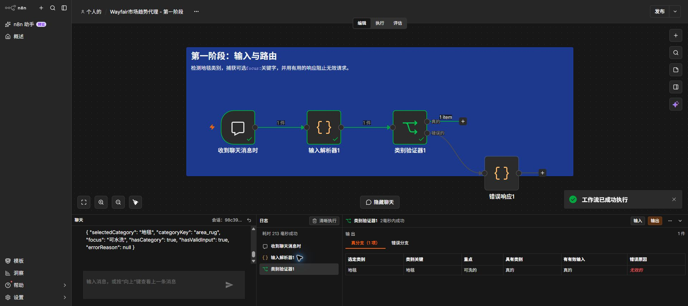
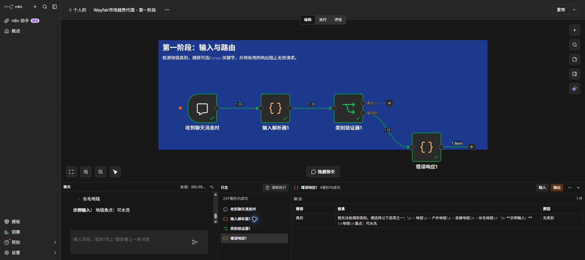

# Project 2 — Step 2: Stage 1 Input & Routing

## Objective

Build the gatekeeper for the Market Trend Discovery Agent. The workflow accepts a chat message, detects one of four standardized rug categories, extracts an optional `focus:` keyword, and routes invalid input to a clear corrective response.

## Nodes

1. **When chat message received** — accepts the user's message.
2. **Input Parser1** — detects Area Rug, Outdoor Rug, Hallway Runner, or Shag Rug and extracts an optional focus keyword.
3. **Category Validator1** — sends valid messages through the true branch and invalid messages through the false branch.
4. **Error Response1** — explains which categories are accepted and provides a valid example.

## Required tests

Valid input:

```text
Area Rug
focus: washable
```

Expected parsed fields:

```json
{
  "selectedCategory": "Area Rug",
  "categoryKey": "area_rug",
  "focus": "washable",
  "hasCategory": true,
  "hasValidInput": true,
  "errorReason": null
}
```

Invalid input:

```text
Hello world
```

Expected behavior: the false route reaches **Error Response1** and returns the four allowed categories with an example.

## Verified results

Both required paths were executed successfully in n8n 2.40.3 on 27 September 2026:

- The valid Area Rug request reached the validator's true branch and preserved `area_rug`, `washable`, and `hasValidInput: true`.
- The invalid `Hello world` request reached **Error Response1** with `reason: no_category` and a corrective message.





## Submission reflection

The part that slowed me down was making sure category detection handled variations such as singular, plural, and related terms while still rejecting unrelated inputs. I addressed this by mapping each standardized category to a small, explicit pattern list and keeping validation separate from the error-response logic. This separation makes the workflow easier to test now and easier to extend when later stages add product-data and API failure routes.
