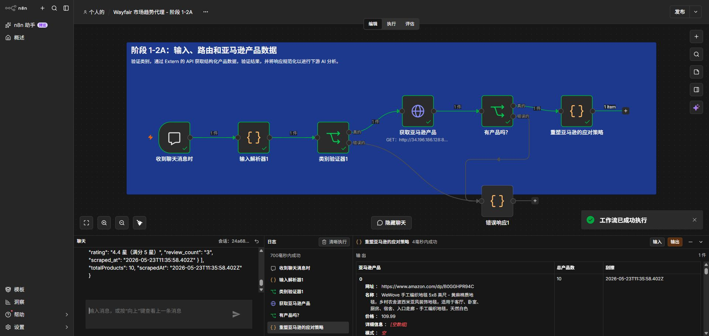

# Project 2 — Step 3: Stage 2A Amazon Product Data

## Objective

Extend the validated true route from Stage 1 with structured Amazon product data supplied by Extern's managed API. The stage requests products, confirms that the response is non-empty, and reshapes the vendor-specific response into a stable contract for downstream AI analysis.

## Workflow

```text
Category Validator1 (True)
  → Fetch Amazon Products
  → Has Products? (True)
  → Reshape Amazon Response

Has Products? (False)
  → Error Response1
```

## Node contracts

### Fetch Amazon Products

- Method: `GET`
- Endpoint: `http://34.196.186.128:8000/api/products/amazon`
- Query parameters: `category`, `limit=10`, and optional `focus`
- Timeout: 30 seconds

### Has Products?

Checks whether `total_products > 0`. A non-empty response moves to normalization; an empty response reuses the existing `no_products` error path.

### Reshape Amazon Response

Creates a stable top-level payload:

```json
{
  "amazonProducts": [],
  "totalProducts": 10,
  "scrapedAt": "2026-05-23T11:35:58.402Z"
}
```

Each product retains its URL, name, price, details, pattern, image URL, rating, review count, and scrape timestamp.

## Verified result

The workflow was tested end-to-end on 27 September 2026 with:

```text
Area Rug
focus: washable
```

The run completed successfully in approximately 700 ms and produced 10 normalized product records.



## AI product considerations

- **Freshness:** the API returned `scraped_at: 2026-05-23T11:35:58.402Z`, so the eventual report must disclose the snapshot date and avoid presenting the evidence as real-time market demand.
- **Reliability:** a 30-second timeout and explicit zero-product route keep vendor latency or empty responses from failing silently.
- **Traceability:** product URLs and scrape timestamps are preserved for evidence review.
- **Stable interface:** downstream AI nodes consume `amazonProducts` rather than depending directly on the API vendor's response shape.
- **Security and deployment:** the supplied endpoint uses plain HTTP, so a production version should use HTTPS and a managed base URL.
