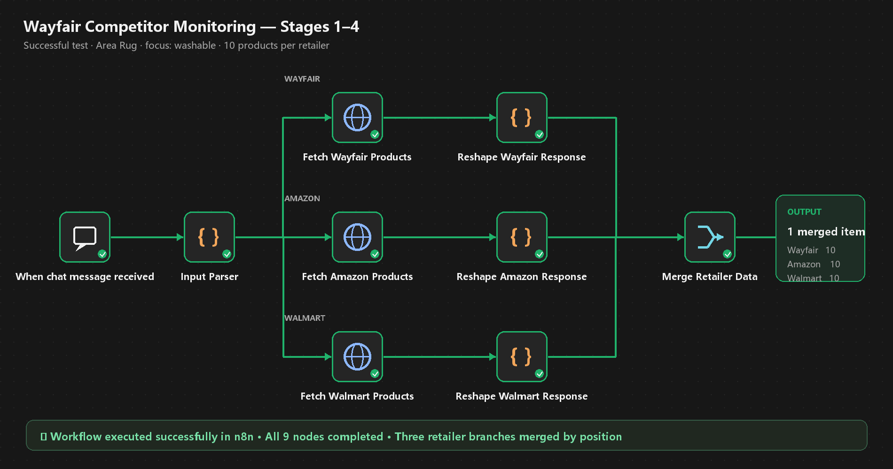

# Project 3 · Step 2 — Competitor Monitoring Stages 1–4

This deliverable implements and verifies the first four stages of the Wayfair Competitor Monitoring Agent in n8n.



## Workflow structure

1. **When chat message received** accepts a natural-language category request.
2. **Input Parser** detects one of four supported rug categories and extracts an optional `focus:` value.
3. Three parallel HTTP Request nodes fetch up to ten products from the program data server for Wayfair, Amazon and Walmart.
4. Three Code nodes normalize the retailer responses into consistent product records.
5. **Merge Retailer Data** combines the three results by position into one downstream item.

## Verified test

Input:

```text
Area Rug
focus: washable
```

Observed result on 27 September 2026:

- all nine nodes completed successfully;
- the execution finished in approximately 1.6 seconds;
- Wayfair returned 10 products;
- Amazon returned 10 products;
- Walmart returned 10 products;
- the Merge node returned one item containing all three retailer arrays.

## Files

- Importable workflow: `workflows/project-3-stage-1-4.json`
- Submission image: `deliverables/project-3-step-2-stage-1-4-tested.png`
- Reproducible image builder: `scripts/build_project3_step2_diagram.py`

No retailer API key is required for these three program-provided product endpoints.
